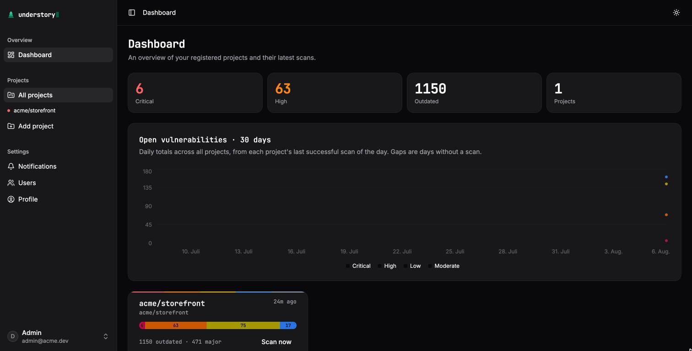

<div align="center">
  

# understory

**Self-hosted npm dependency auditing — see what lives under your dependency tree.**

[](https://github.com/RedEagle-dh/understory/actions/workflows/ci.yml)
[](https://bun.sh)
[](https://www.typescriptlang.org)
[](LICENSE)

[Features](#features) · [Quickstart](#quickstart) · [Configuration](#configuration) · [Automatic pull requests](#automatic-pull-requests) · [Development](#development)

</div>

Point understory at your GitHub repositories and it scans them every hour: **every** dependency — production, dev, peer, optional, direct *and* transitive, straight from the lockfile — checked against the npm advisory database **and** OSV.dev, with outdated-version detection against the npm registry. It notifies you through Discord or email, and opens version-bump pull requests: manually from the UI, automatically when a fixable vulnerability appears, or automatically for routine updates once a release has survived a configurable supply-chain cooldown.

Everything runs in a single container with a single SQLite file. No SaaS, no agents in your CI, no code execution from scanned repositories.

<p align="center">
  
</p>

## Features

- **Full dependency extraction** — parses `package-lock.json` (v1/v2/v3) and `bun.lock` including workspaces, `catalog:` ranges, peer dependencies, and depth. Snapshots are content-addressed by lockfile hash, so unchanged repositories cost almost nothing to rescan.
- **Two advisory sources, one truth** — npm bulk advisories and OSV.dev, normalized and merged by canonical ID (GHSA → CVE → OSV) with alias cross-referencing. Fix versions are computed across *all* ranges affecting a package, not taken on faith.
- **Scan diffing** — every scan knows which findings are new, which resolved, and which majors just appeared; one indexed query, no snapshot comparison. Diffs drive notifications, so you hear about changes — not about the same finding every hour.
- **Considerate scheduling** — a per-minute dispatcher with per-project offsets (no thundering herd), bounded concurrency, ETag caching against GitHub and the registry, and exponential backoff for failing projects.
- **Notifications** — Discord webhooks and email (via [Resend](https://resend.com)), with global or per-project rules, severity thresholds, delivery dedupe, and retries with backoff. A daily digest covers slow-moving outdated counts.
- **Pull requests that merge green** — PRs are created through the GitHub Git Data API as a single commit, with operator-preserving range rewrites (`^4.17.15 → ^4.17.21`), root-catalog edits for `catalog:` monorepos, and lockfile regeneration (`--ignore-scripts`, sandboxed) so `npm ci` passes on arrival. Deterministic branch names make retries converge instead of littering your repo.
- **Local users with RBAC** — `viewer`, `maintainer`, and `admin` roles, enforced server-side on every route. No external identity provider required.
- **Secrets sealed at rest** — GitHub tokens and channel credentials are AES-256-GCM encrypted with per-row binding; key rotation supported.

## Quickstart

No clone required — create a `docker-compose.yml`:

```yaml
services:
  understory:
    image: ghcr.io/redeagle-dh/understory:latest
    restart: unless-stopped
    ports:
      - "3001:3001"
    volumes:
      - understory-data:/data
    environment:
      APP_URL: http://localhost:3001
      TRUSTED_ORIGINS: http://localhost:3001
      APP_ENCRYPTION_KEY: ${APP_ENCRYPTION_KEY:?generate with openssl rand -base64 32}
      BETTER_AUTH_SECRET: ${BETTER_AUTH_SECRET:?generate with openssl rand -base64 32}
      # GITHUB_TOKEN: ghp_…   # optional fallback token for private repos / rate limits

volumes:
  understory-data:
```

Then start it:

```sh
export APP_ENCRYPTION_KEY=$(openssl rand -base64 32)
export BETTER_AUTH_SECRET=$(openssl rand -base64 32)
docker compose up -d
```

Open http://localhost:3001 and create your account. The image is published for **amd64 and arm64**, so this works on x86 servers and ARM boxes (Raspberry Pi, Apple Silicon, Graviton) alike.

To build from source instead, clone the repo and use [`docker/docker-compose.yml`](docker/docker-compose.yml) with `docker compose up -d --build`.

> [!NOTE]
> The **first account to sign up becomes the administrator**, after which public registration closes. Admins create further users from Settings → Users.

Add a repository (owner + repo; a token is only needed for private repos or to avoid anonymous rate limits) and the first scan starts immediately. Hourly scans, notifications, and automatic PRs take it from there.

> [!IMPORTANT]
> Persist the two keys in an `.env` file next to your `docker-compose.yml` (Compose reads it automatically) instead of re-exporting them per shell — `APP_ENCRYPTION_KEY` seals tokens in the database, and a regenerated key makes them unrecoverable. Back up the SQLite file WAL-safely with `sqlite3 /data/app.db ".backup /data/backup.db"`.

## Configuration

Everything is configured through environment variables — see [.env.example](.env.example) for the full annotated list.

| Variable | Required | Purpose |
|---|---|---|
| `APP_ENCRYPTION_KEY` | yes | 32-byte base64 key sealing tokens and channel secrets at rest |
| `BETTER_AUTH_SECRET` | yes | Session signing secret |
| `APP_URL` | in production | Public origin — cookies and links in notifications |
| `GITHUB_TOKEN` | no | Fallback token when a project has none of its own |
| `SCAN_CONCURRENCY` | no | Parallel scans (default `3`) |
| `ENABLE_LOCKFILE_REGEN` | no | Regenerate lockfiles in PRs (default `true`) |
| `DISABLE_OSV` | no | Skip the OSV.dev advisory source |
| `METRICS_ENABLED` / `METRICS_TOKEN` | no | Prometheus `/metrics`, optionally bearer-gated |
| `UPDATE_CHECK` | no | Check GitHub releases for a newer version and show a notice in the UI (default `true`; set `false` for air-gapped installs) |

> [!TIP]
> Use a **fine-grained personal access token** with `contents: read/write` and `pull requests: read/write` scoped to the repositories you track. Tokens can be set globally or per project in the UI, and are only ever stored sealed.

**Notifications:** Discord needs only a webhook URL. Email needs a Resend API key and a verified sending domain — Discord-only works fine without one.

## Automatic pull requests

understory opens PRs on two independent tracks, both configured per project:

**Security fixes** — when a scan finds a new vulnerability with an available fix, a PR is opened immediately, gated by a minimum severity and a maximum allowed version jump (never auto-ship a breaking major unless you say so). Fixes are deliberately *not* delayed by the cooldown below.

**Version bumps** — outdated direct dependencies are bumped to `latest` in one batched PR, bounded by:

- **Update kind** — patch only, up to minor, or up to major.
- **Release-age cooldown** — a new version only qualifies after it has been public on the registry for a configurable time (days + hours, default 3 days). This is supply-chain protection: compromised releases are typically discovered and yanked within days, and understory simply refuses to ship a release younger than your threshold. Unknown publish dates fail closed.

Only one bump PR is kept open at a time; a fresh one opens after the previous merges or closes.

## Development

Requirements: [Bun](https://bun.sh) ≥ 1.3.

```sh
bun install
cp .env.example apps/api/.env        # fill the two required keys
bun run --filter @workspace/api dev  # API on :3001
bun run --filter web dev             # web on :3000, proxies /api to :3001
```

`bun run typecheck` · `bun run lint` · `bun run format` · `bun test` · `bun run build` — all run through turbo at the root. TypeScript 7 (native compiler) everywhere; biome for linting **and** formatting (including Tailwind class sorting).

### Architecture

| Path | What it is |
|---|---|
| `apps/api` | Elysia + Bun API on the vendored **declarative** framework — every route and job is a typed contract; RBAC is a compile-enforced per-route `policy` declaration |
| `apps/web` | TanStack Start SPA (React 19, Tailwind v4, shadcn/ui), end-to-end typed against the API via Eden treaty |
| `packages/audit-engine` | Pure domain logic: lockfile parsers, registry/OSV clients, advisory normalization and merge, outdated/fix/peer computation, bump planning — zero I/O in tests |
| `packages/db` | Drizzle + `bun:sqlite` schema, migrations, sealed-secret crypto |
| `packages/ui` | Shared shadcn component library |
| `packages/declarative` | Vendored `@declarativejs/*` framework (see `VENDORED.md`) |

Worth reading: `apps/web/DESIGN.md` for the UI language, and the schema comments in `packages/db/src/schema/` for the content-addressed dependency snapshots and the findings lifecycle that makes scan-diffing a single indexed query.

### Security posture

- Lockfile regeneration runs `npm`/`bun` with `--ignore-scripts` in a scrubbed temporary directory — dependency code never executes.
- The API enforces RBAC server-side on every route; UI role gating is cosmetic on top.
- Scanned repository content is only ever parsed, never evaluated.

## Known limitations

> [!WARNING]
> - Repositories **without a committed lockfile** currently scan to zero dependencies — declared ranges alone aren't resolved against the registry yet.
> - `yarn.lock` and `pnpm-lock.yaml` are detected but not yet parsed; `bun.lockb` (binary) is not supported — commit the text `bun.lock` instead.
> - Roles are global (not per-project) in this release.
